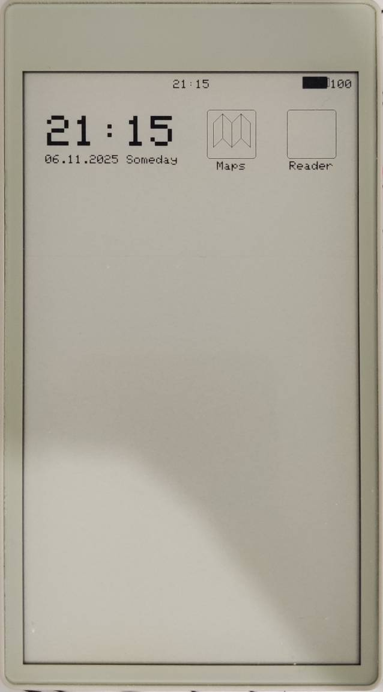

# EDC PDA

Project for transforming the M5Stack PaperS3 into a PDA for daily use.

## Core fatures

- High abstraction layers (HAL/Services/Applications)

## System

- [+] Touch events now can handle in apps
- [+] Support touch events: tap, doble tap, swipe in four direction, long press, drag.
- [ ] Special vector image render.

## Applicaitons

### Header 

- [+] Header is separate 'special' application 
- [+] Draw time
- [ ] Can grow to show special buttons
- [ ] Draw battery text
- [ ] Draw battery graphically
- [ ] Draw BT icon
- [ ] Draw WiFi icon
- [ ] Draw DEBUG info (free RAM size)

### Menu

- [+] Work with RTC hal API
- [+] Use CELL grid to place widgets
- [+] Draw apps at any cell
- [+] Draw datetime information in 2 merged cell
- [+] Apps now can draw self icons in full 16 colors.

### Maps

No work on maps at this time

### Reader

No work on reader at this time
